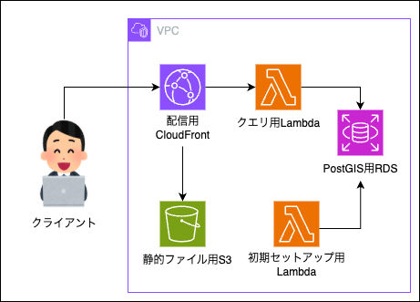

# postgis-app

最寄りの世界遺産を取得するウェブサイト。
PostGIS の検証用アプリ。

## アーキテクチャ


## ディレクトリ構成

```
.
├── frontend
│   ├── app
│   └── terraform
├── backend
│   └── lambda
│   └── XXX.tf
├── setup.sh
├── delete.sh
└── README.md
```

## 作成

### 構築

以下コマンドでバックエンド、およびフロントエンドの環境を構築します。

```
bash setup.sh;
```

DBセットアップ用のLambda関数を実行します。

```
aws lambda invoke --function-name nearest-world-heritage-site-rds-setup outputfile.txt
```

#### ローカル環境

表示される`http://localhost:3000/`へブラウザからアクセスしてください。

```
npm run dev;
```

#### デプロイ環境

表示される`cloudfront_url`へブラウザからアクセスしてください。

```
terraform output;
```
```
cloudfront_url = "XXXXXXXXXXXXXX.cloudfront.net"
```

### 削除

```
bash delete.sh;
```
